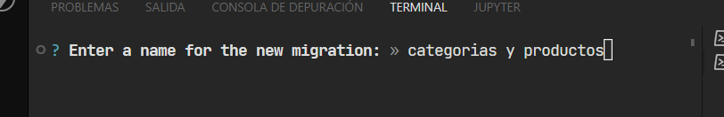
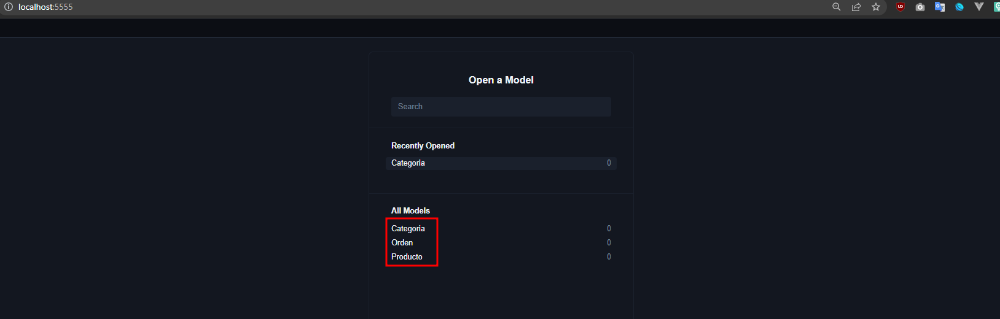
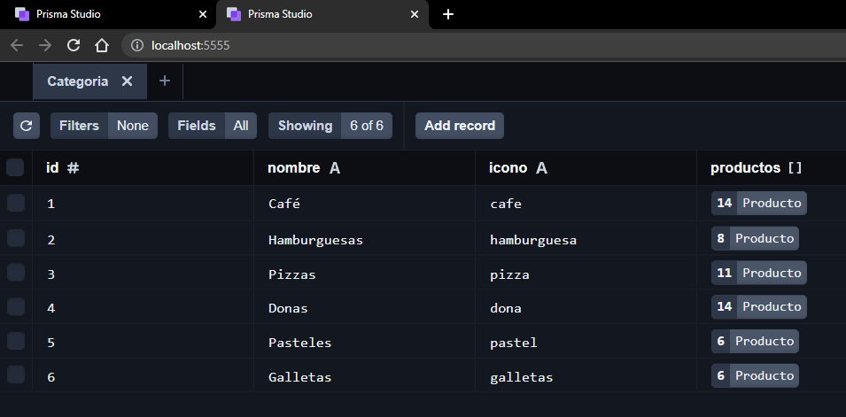

```npx create-next-app@latest```

## **Tailwind css en NEXTJS**

```npm i -D tailwindcss postcss autoprefixer```

```npx tailwindcss init -p```

Desde el tailwind.config.js:

```js
/** @type {import('tailwindcss').Config} */
module.exports = {
  content: [
    "./layout/**/*.{js,jsx,ts,tsx}",
    "./pages/**/*.{js,jsx,ts,tsx}",
    "./components/**/*.{js,jsx,ts,tsx}"
  ],
  theme: {
    extend: {},
  },
  plugins: [],
}
```

**Conservar solo el globals.css con:**

```js
@tailwind base;
@tailwind components;
@tailwind utilities;
```

**Reiniciar el servidor**

---

## **PRISMA**

> Prisma es un ORM, es una capa para conectarnos a una base de datos y manipularla sin realizar las funciones manualmente.

[Visita Prisma >>>](https://www.prisma.io/)

```npm i -D prisma```

```npm i @prisma/client```

```npx prisma init```


## **Crear Base de Datos**

Prisma soporta variedad de Bases de datos. En este caso MySQL

[Descargar MySQL](https://dev.mysql.com/downloads/windows/installer/8.0.html)

Desde la terminal:
```mysql -u root```

```create database puntoventa;```

---

## Modelado

Se crean modelos en el archivo de **schema.prisma**

Se indican los tipos de dato, y prisma se encargará de proporcionarlo a la DB con el formato correcto.

> Un producto tiene una categoria y una Categoria tiene varios Productos. La relación se hace mediante llaves primarias y foráneas, por lo tanto, deben ser del mismo tipo.

```js
model Producto {
  id Int @id @default(autoincrement())
  nombre String
  precio Float
  imagen String?
  categoriaId Int
  categoria Categoria @relation(fields: [categoriaId],references: [id])
}

model Categoria {
  id Int @id @default(autoincrement()) 
  nombre String
  icono String
  productos Producto[]
}
```

---

## Migración

El esquema que estructuremos en prisma debe ser migrado, es decir, aplicado directamente en la base de datos mediante: 

```npx prisma migrate dev```



> **Siempre que se edite o agregue al esquema se debe migrar para actualizar el esquema**

## RESET DATOS TABLAS

```npx prisma migrate reset```

## Interfaz Recursos Prisma

```npx prisma studio```



---

## Seeding
Sembrar información a la base de datos. Por ejemplo, con la siguiente información:

```js
const categorias = [
    {
        icono: "cafe",
        nombre: "Café"
      },
      {
        icono: "hamburguesa",
        nombre: "Hamburguesas"
      },
]

// Basado en el modelo
model Categoria {
  id Int @id @default(autoincrement()) 
  nombre String
  icono String
  productos Producto[]
}
```
Crear archivo **seed.ts** en la carpeta prisma

```js
import {categorias} from './data/categorias'  // Arreglo de categorias

// Siempre que se manipule la bdd
import { PrismaClient } from '@prisma/client'

const prisma = new PrismaClient()

const main = async () : Promise<void> => {
    try {
        //instancia prisma - modelo en minusculas - metodo
        await prisma.categoria.createMany({
            data: categorias
        })
    } catch (error) {
        console.log(error)
    }
}

main()
```
## **Para sembrar los valores:**
Instalar dependencia ```npm i ts-node```

Modificar el archivo **package.json** y agregar un nueva referencia para prisma y el comando seed:

```js
  ...
  "prisma":{
    "seed": "ts-node prisma/seed.ts"
  },
  ...
```
Desde la terminal ejecutar **npx prisma db seed**

Lo anterior inserta los objetos segun el modelo y actualiza la base de datos.

Si se ejecuta npx prisma studio los elementos se visualizarán.



---

# **Consultar BDD con NEXTJS y Prisma**

## **Con server side props**

```js

import {PrismaClient} from '@prisma/client'

export default function Home({categorias}) {
  console.log(categorias)
  return (
    <h1> Next JS </h1>
  )
}

export const getServerSideProps = async () => {
  const prisma = new PrismaClient()

  const categorias = await prisma.categoria.findMany();

  return {
    props: {
      categorias
    }
  }
}
```

## **Con la API de NEXTJS**

> En la carpeta pages por defecto hay una carpeta llamada api, esos archivos siempre corren del lado del servidor. Se pueden acceder a través de su ruta respectiva **localhost:3000/api/archivo.js**

Por ejemplo, en el directorio **pages - api - categorias.js** el contenido es el siguiente:

```js

import {PrismaClient} from '@prisma/client'

const prisma = new PrismaClient()

export default async function handler(req, res) {
  //logic 
  const categorias = await prisma.categoria.findMany()
  res.status(200).json(categorias)
}

```

## **¿Cuando utilizar ServerSideProps y cuando utilizar la API de NEXTJS**
> ServerSideProps es mas cuando utilizas la informacion directamente en un componente, pero cuando necesitas extender esa informacion es mejor utilizar la API para que pueda ser accedido de manera mas sencilla.

## Context API

1. Crear carpeta **context** en la raiz del proyecto
2. Crear un archivo para el provider y colocar algo similar a lo siguiente:
```js
import React,{useState,useEffect,createContext} from 'react'

const QuioscoContext = createContext()

const QuioscoProvider = ({children}) => {
  return (
    <QuioscoContext.Provider
        value={{
            
        }}
    >
        {children}
    </QuioscoContext.Provider>
  )
}

export {
    QuioscoProvider
}

export default QuioscoContext
```
3. Desde el componente _app.js aplicar el Provider
```js
import {QuioscoProvider} from '../context/QuioscoProvider'

function MyApp({ Component, pageProps }) {
  return <QuioscoProvider>
    <Component {...pageProps} />
  </QuioscoProvider>
}

export default MyApp

```

### **Crear carpeta hooks y useQuiosco.jsx**
```js
import { useContext } from "react";
import QuioscoContext from "../context/QuioscoProvider";

const useQuiosco = () => { 
    return useContext(QuioscoContext);
}

export default useQuiosco;
```

---

## Consumir API categorias
```npm i axios```
```js
import axios from 'axios'
const {data} = await axios('/api/categorias')
```